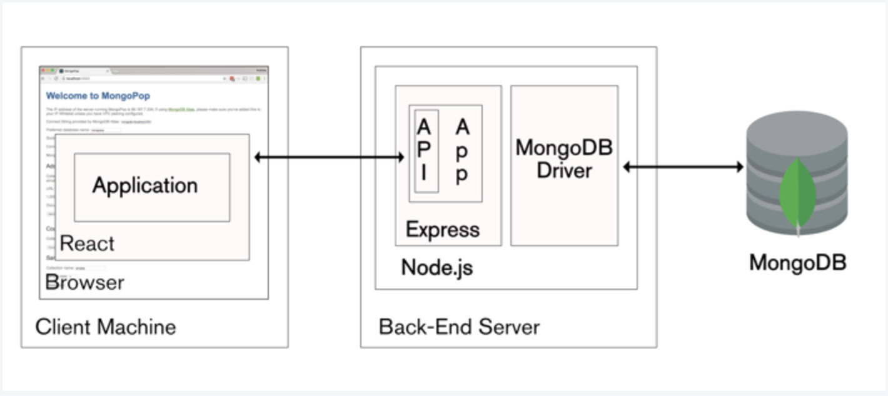

# mern

MERN Sprint of the Ubiqum bootcamp
MERN = MongoDB, Express, React, Node.js

## Create React project, and name it “client”

run command: npx create-react-app client

### setup

- public/index.html is the page template
- src/index.js is the JavaScript entry point
- You can delete or rename the other files
- For faster rebuilds, only files inside src are processed by Webpack (packager tool to build and deploy web projects)
- Only files inside public can be used from public/index.htm

## Run the client app

Lets run the react app template with the following command. Make sure your terminal is at the root of the client directory (you might have to change directory using the command "cd client"): npm start

## Useful Links

[Components and Props](https://reactjs.org/docs/components-and-props.html)

[JSX Intro](https://reactjs.org/docs/introducing-jsx.html)

[State and Lifecycle](https://reactjs.org/docs/state-and-lifecycle.html)
